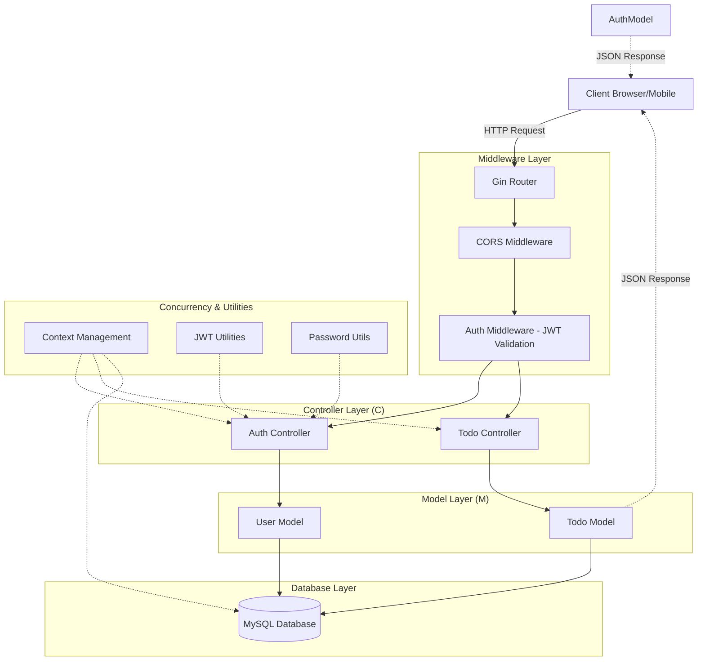

# Project Documentation: Todo Application

This document provides a technical overview of the Todo application, its architecture, and its implementation details.

## 1. Project Overview

The Todo Application is a RESTful API built with the Go programming language, utilizing the **Gin** web framework and **GORM** for ORM. It features a robust authentication system (JWT), role-based authorization (ownership checking), and follows a clean **MVC (Model-View-Controller)** architecture.

---

## 2. Architecture Diagram

The following diagram illustrates the system architecture and the flow of a typical request.



---

## 3. Technology Stack

- **Language:** Go (Golang) 1.21+
- **Framework:** Gin Web Framework
- **ORM:** GORM (Go Object Relational Mapper)
- **Database:** MySQL
- **Authentication:** JWT (JSON Web Tokens)
- **Security:** Bcrypt (Password Hashing)
- **Configuration:** Dotenv

---

## 4. Design Patterns & Principles

### MVC (Model-View-Controller)
- **Model:** Defined in the `models/` directory. Handles data structure and database interactions.
- **View:** Representation is handled via JSON responses directly from controllers (Gin's `c.JSON`).
- **Controller:** Defined in the `controllers/` directory. Orchestrates the flow of data between models and views.

### Modular Architecture
The code is split into logical modules:
- `config/`: Database and environment setup.
- `middlewares/`: Security and request pre-processing.
- `routes/`: Centralized route management.
- `utils/`: Reusable helper functions (JWT, Password, Context).

---

## 5. Concurrency Model

The application leverages Go's native concurrency features:

1.  **Goroutines:** 
    - The HTTP server runs in its own goroutine to allow for non-blocking startup.
    - Database connection is initialized in a goroutine to prevent the main thread from hanging during network latency.
2.  **Channels:** 
    - Used for signaling OS interrupts (`SIGINT`, `SIGTERM`).
    - Used for communicating server errors back to the main thread.
    - Used for database connection synchronization.
3.  **Context (Timeout/Cancellation):**
    - Every database operation is context-aware.
    - Request timeouts (5s) are enforced via `context.WithTimeout`.
    - Graceful shutdown implements a 10s window to finish inflight requests.

---

## 6. Directory Structure

```text
todo/
├── config/             # Database connection & pooling
├── controllers/        # Business logic & request handling
├── middlewares/        # JWT Authentication logic
├── models/             # GORM definitions & DB queries
├── routes/             # API endpoint definitions
├── utils/              # JWT, Password hashing, Context helpers
├── main.go             # Entry point & Graceful shutdown logic
├── .env                # Secret keys & DB credentials
└── go.mod              # Dependency management
```

---

## 7. Security Implementation

- **JWT Authentication:** Tokens are issued upon login and validated using a custom middleware.
- **Password Hashing:** Uses `bcrypt.DefaultCost` to safely store user credentials.
- **Authorization:** Before any `Update` or `Delete` operation, the system verifies `todo.UserID == current_user_id`.
- **CORS:** Secure cross-origin resource sharing is configured to allow specific headers and methods.

---

## 8. Graceful Shutdown

The application is designed for production stability. Upon receiving a termination signal, it:
1.  Stops accepting new requests.
2.  Allows active requests up to 10 seconds to complete.
3.  Closes the database connection pool safely.
4.  Exits with a clean status code.
