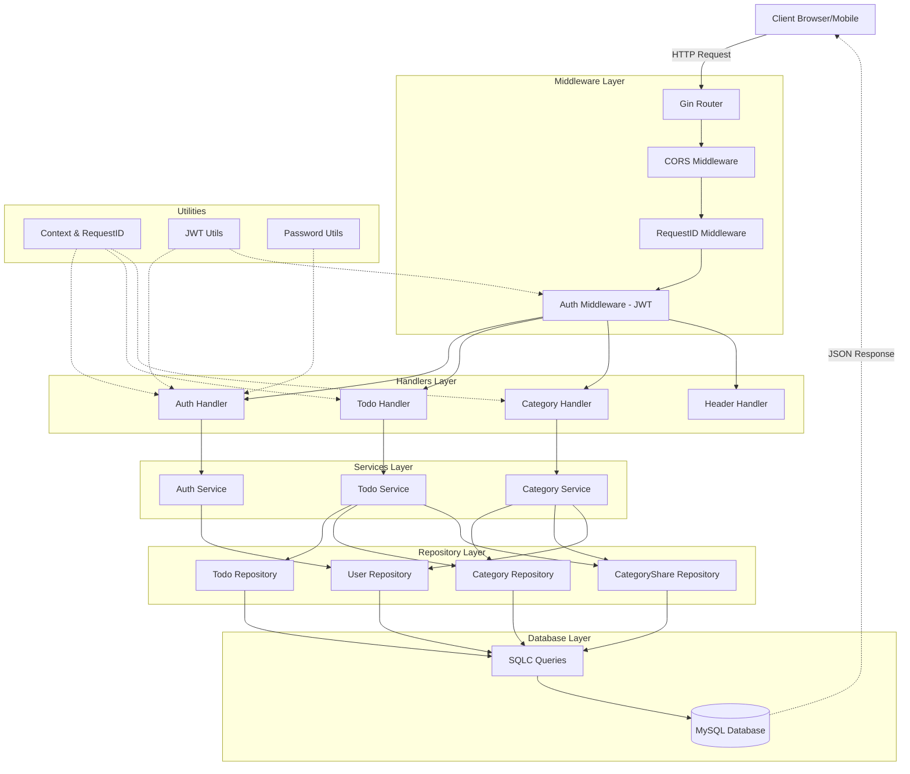

# Project Documentation: Todo Application

This document provides a technical overview of the Todo application, its architecture, and implementation details.

---

## Table of Contents

1. [Project Overview](#1-project-overview)
2. [Architecture Diagram](#2-architecture-diagram)
3. [Technology Stack](#3-technology-stack)
4. [Layered Architecture](#4-layered-architecture)
5. [Design Patterns & Principles](#5-design-patterns--principles)
6. [Context & Request Tracing](#6-context--request-tracing)
7. [Concurrency Model](#7-concurrency-model)
8. [Security Implementation](#8-security-implementation)
9. [Database Layer (SQLC)](#9-database-layer-sqlc)
10. [Graceful Shutdown](#10-graceful-shutdown)
11. [Testing Strategy](#11-testing-strategy)
12. [API Reference](#12-api-reference)
13. [Environment Variables](#13-environment-variables)
14. [Architecture Evolution: Before vs After](#14-architecture-evolution-before-vs-after)

---

## 1. Project Overview

The Todo Application is a RESTful API built with Go, utilizing the **Gin** web framework and **SQLC** for type-safe database access. It features JWT authentication, **category-based sharing with permissions**, and follows a clean **Layered Architecture** with proper separation of concerns.

---

## 2. Architecture Diagram

The following diagram illustrates the system architecture and request flow.



---

## 3. Technology Stack

| Category | Technology |
|----------|------------|
| Language | Go (Golang) 1.21+ |
| Framework | Gin Web Framework |
| DB Access | SQLC (type-safe SQL generation) |
| Database | MySQL 8.0+ |
| Authentication | JWT (JSON Web Tokens) |
| Security | Bcrypt (Password Hashing) |
| Configuration | godotenv |

---

## 4. Layered Architecture

### Layer Responsibilities

```
┌─────────────────────────────────────────────────────────────────┐
│                      cmd/server/main.go                         │
│  - Application entry point                                      │
│  - Dependency wiring (DI container)                            │
│  - Server lifecycle management                                  │
└─────────────────────────────────────────────────────────────────┘
                              │
                              ▼
┌─────────────────────────────────────────────────────────────────┐
│                    internal/handlers/                           │
│  - HTTP request/response handling                               │
│  - Input validation                                             │
│  - Calls service layer                                          │
│  - Returns JSON responses                                       │
└─────────────────────────────────────────────────────────────────┘
                              │ depends on services interfaces
                              ▼
┌─────────────────────────────────────────────────────────────────┐
│                    internal/services/                           │
│  - Business logic                                               │
│  - Permission checking                                          │
│  - Orchestrates repository calls                                │
│  - Implements service interfaces                                │
└─────────────────────────────────────────────────────────────────┘
                              │ depends on repository interfaces
                              ▼
┌─────────────────────────────────────────────────────────────────┐
│                    internal/repository/                         │
│  - Data access logic                                            │
│  - Converts DB types to domain models                           │
│  - Implements repository interfaces                             │
└─────────────────────────────────────────────────────────────────┘
                              │ depends on db.Queries
                              ▼
┌─────────────────────────────────────────────────────────────────┐
│                          db/                                    │
│  - SQLC generated code                                          │
│  - Type-safe SQL queries                                        │
│  - Database connection management                               │
└─────────────────────────────────────────────────────────────────┘
```

### Directory Structure

```
todo-app/
├── cmd/
│   └── server/
│       ├── main.go              # Application entrypoint
│       └── app.go               # Application setup & DI wiring
├── config/
│   └── config.go                # Configuration management
├── db/                          # SQLC generated code
│   ├── queries/                 # SQL query definitions
│   │   ├── auth.sql
│   │   ├── todos.sql
│   │   ├── category.sql
│   │   └── category_share.sql
│   ├── schema.sql               # Database schema
│   ├── conn.go                  # Connection management
│   ├── db.go                    # SQLC generated
│   └── models.go                # SQLC generated models
├── internal/
│   ├── dto/                     # Data Transfer Objects
│   │   ├── auth.go
│   │   ├── todo.go
│   │   └── category.go
│   ├── handlers/                # HTTP handlers (Controllers)
│   │   ├── auth_handler.go
│   │   ├── todo_handler.go
│   │   ├── category_handler.go
│   │   ├── header_handler.go
│   │   └── helpers.go
│   ├── services/                # Business logic
│   │   ├── interfaces.go        # Service interfaces
│   │   ├── auth_service.go
│   │   ├── todo_service.go
│   │   ├── category_service.go
│   │   └── mocks/               # Mock implementations
│   ├── repository/              # Data access layer
│   │   ├── interfaces.go        # Repository interfaces
│   │   ├── user_repo.go
│   │   ├── todo_repo.go
│   │   ├── category_repo.go
│   │   ├── category_share_repo.go
│   │   └── mocks/               # Mock implementations
│   ├── middleware/              # HTTP middleware
│   │   ├── auth.go              # JWT authentication
│   │   └── request_id.go        # Request ID injection
│   └── models/                  # Domain models (pure data)
│       ├── user.go
│       ├── todo.go
│       └── category.go
├── pkg/
│   └── utils/                   # Shared utilities
│       ├── jwt.go               # JWT generation/validation
│       └── request_id.go        # Request ID helpers
├── routes/
│   └── routes.go                # Route definitions
├── go.mod
├── go.sum
└── sqlc.yaml                    # SQLC configuration
```

---

## 5. Design Patterns & Principles

### Dependency Injection

All dependencies are injected via constructors, not package-level globals:

```go
// app.go - Dependency wiring
userRepo := repository.NewSQLUserRepository(db.Queries)
todoRepo := repository.NewSQLTodoRepository(db.Queries)
categoryRepo := repository.NewSQLCategoryRepository(db.Queries)
categoryShareRepo := repository.NewSQLCategoryShareRepository(db.Queries)

authSvc := services.NewAuthService(userRepo, jwtManager)
todoSvc := services.NewTodoService(todoRepo, categoryRepo, categoryShareRepo, paginationConfig)
categorySvc := services.NewCategoryService(categoryRepo, categoryShareRepo, userRepo)

authHandler := handlers.NewAuthHandler(authSvc)
todoHandler := handlers.NewTodoHandler(todoSvc)
categoryHandler := handlers.NewCategoryHandler(categorySvc)
```

### Interface-Based Design

Services and repositories implement interfaces for:
- **Testability**: Easy to mock in unit tests
- **Flexibility**: Swap implementations without changing dependent code
- **Clear Contracts**: Explicit API definitions

```go
// Service Interface
type TodoService interface {
    CreateTodo(ctx context.Context, req dto.CreateTodoRequest) (*models.Todo, error)
    GetTodos(ctx context.Context, userID uint, page, pageSize int) (*dto.TodoListResponse, error)
    GetTodoByID(ctx context.Context, req dto.GetTodoRequest) (*models.Todo, error)
    UpdateTodo(ctx context.Context, req dto.UpdateTodoRequest) (*models.Todo, error)
    DeleteTodo(ctx context.Context, req dto.DeleteTodoRequest) error
}

// Repository Interface
type TodoRepository interface {
    CreateTodo(ctx context.Context, todo *models.Todo) error
    GetTodos(ctx context.Context, userID uint, page, pageSize int) ([]models.Todo, int64, error)
    GetTodoByID(ctx context.Context, id uint) (*models.Todo, error)
    UpdateTodo(ctx context.Context, todo *models.Todo) error
    DeleteTodo(ctx context.Context, id uint) error
}
```

### Separation of Concerns

| Layer | Contains | Does NOT Contain |
|-------|----------|------------------|
| Models | Pure data structures | Database logic, business rules |
| Repository | Data access, DB type conversion | HTTP handling, business rules |
| Services | Business logic, permission checking | HTTP handling, direct DB access |
| Handlers | HTTP handling, validation | Business logic, direct DB access |

---

## 6. Context & Request Tracing

### Request ID

Every request gets a unique UUID injected by middleware:

```go
// Middleware injects Request ID
ctx := context.WithValue(c.Request.Context(), utils.RequestIDKey, rid)
c.Writer.Header().Set("X-Request-Id", rid)
```

### Typed Context Keys

Using typed keys to avoid collisions:

```go
type ContextKey string
const RequestIDKey ContextKey = "requestID"
```

### Usage in Logs

```go
rid := utils.GetRequestID(c.Request.Context())
log.Printf("[CreateTodo] request=%s user=%v error=%v", rid, userID, err)
```

---

## 7. Concurrency Model

### Goroutines
- HTTP server runs in its own goroutine for non-blocking startup
- Database operations are context-aware and cancellable

### Channels
- OS signal handling (`SIGINT`, `SIGTERM`) via channels
- Server error communication back to main goroutine

### Context (Timeout/Cancellation)
- Every DB operation accepts a context
- Request timeouts (5s) enforced via `context.WithTimeout`
- Graceful shutdown implements a 10s window

```go
// Request timeout for DB operations
ctx, cancel := context.WithTimeout(c.Request.Context(), 5*time.Second)
defer cancel()
```

---

## 8. Security Implementation

### JWT Authentication
- Tokens issued upon login with 24-hour expiry
- Validated in `AuthMiddleware` for protected routes
- User ID extracted and stored in Gin context

### Password Hashing
- Bcrypt with default cost factor
- Passwords never stored in plain text

### Authorization (Category-Based Permissions)
- **Owner**: Full access to category and all todos within
- **Write**: Can create, read, update, delete todos in shared category
- **Read**: Can only view todos in shared category
- Permission checks happen at the service layer

### CORS Configuration
```go
c.Writer.Header().Set("Access-Control-Allow-Origin", "*")
c.Writer.Header().Set("Access-Control-Allow-Headers",
    "Content-Type, Authorization, X-Custom-Header, ...")
c.Writer.Header().Set("Access-Control-Allow-Methods",
    "POST, OPTIONS, GET, PUT, DELETE")
```

---

## 9. Database Layer (SQLC)

### Why SQLC?
- **Type Safety**: Compile-time checking of SQL queries
- **Performance**: No runtime reflection (unlike ORMs)
- **Control**: Write actual SQL, not ORM abstractions

### Configuration (sqlc.yaml)
```yaml
version: "2"
sql:
  - engine: "mysql"
    queries: "db/queries"
    schema: "db/schema.sql"
    gen:
      go:
        package: "db"
        out: "db"
        emit_json_tags: true
        emit_db_tags: true
```

### Regenerating Queries
```bash
sqlc generate
```

---

## 10. Graceful Shutdown

The application handles termination signals gracefully:

1. Receives `SIGINT` or `SIGTERM`
2. Stops accepting new requests
3. Allows active requests 10 seconds to complete
4. Closes database connection pool
5. Exits with clean status code

```go
shutdownCtx, shutdownCancel := context.WithTimeout(context.Background(), 10*time.Second)
defer shutdownCancel()

if err := srv.Shutdown(shutdownCtx); err != nil {
    log.Printf("Server forced to shutdown: %v", err)
}
```

---

## 11. Testing Strategy

The project uses **unit tests** (handlers and services with mocks) and **integration tests** (full stack with a real MySQL database).

### Unit Tests (Handlers)
```go
// Mock the service
mockService := &mocks.MockTodoService{
    CreateTodoFunc: func(ctx context.Context, req dto.CreateTodoRequest) (*models.Todo, error) {
        return &models.Todo{ID: 1, Title: req.Title}, nil
    },
}

// Test the handler
handler := handlers.NewTodoHandler(mockService)
```

### Unit Tests (Services)
```go
// Mock the repositories
mockTodoRepo := &mocks.MockTodoRepository{}
mockCategoryRepo := &mocks.MockCategoryRepository{}
mockCategoryShareRepo := &mocks.MockCategoryShareRepository{}

// Test the service
service := services.NewTodoService(mockTodoRepo, mockCategoryRepo, mockCategoryShareRepo, config)
```

### Integration Tests

Integration tests verify the full request path: HTTP → handlers → services → repository → real MySQL. They do not use mocks and require a running MySQL instance.

**Location and build tag:**
- Tests live in `tests/integration/` (e.g. `auth_test.go`, `health_test.go`, `todo_test.go`).
- Each file has `//go:build integration` at the top, so they are **excluded** from `go test ./...` unless the tag is set. This keeps CI and local unit-test runs free of database requirements.

**Test utilities (`tests/testutil/`):**
- **Config:** `LoadTestConfig()` reads DB and JWT settings from env (prefers `TEST_DB_*`, falls back to `DB_*`).
- **App:** `NewTestApp(t, schemaPath)` connects to the test DB, runs migrations, and returns the same router as production (for `httptest`) plus a cleanup function that truncates tables and closes the DB.
- **Helpers:** `TruncateAll()`, `MustRegister()`, `MustLogin()`, `Request()` to keep tests short and consistent.

**Environment:** Set `DB_HOST`, `DB_PORT`, `DB_USER`, `DB_PASSWORD`, `DB_NAME` (use a dedicated DB such as `todo_test`), and `JWT_SECRET`. Tables are truncated before and after each test.

**Running integration tests:**
```bash
# Load .env then run (recommend DB_NAME=todo_test in .env for tests)
set -a && source .env && set +a && go test -v -tags=integration ./tests/integration/...

# Or export variables and run
go test -v -tags=integration ./tests/integration/...
```

**Coverage:** Health check, auth (register, login, duplicate email, wrong password, protected route without token), and todo CRUD (create, list, get by ID, update, delete, 404 after delete).

### Running Tests
```bash
# Run unit tests only (default)
go test ./...

# Run with verbose output
go test -v ./...

# Run specific package
go test ./internal/services -v

# Run with coverage
go test -cover ./...

# Run integration tests (requires MySQL and env)
go test -v -tags=integration ./tests/integration/...
```

---

## 12. API Reference

### Authentication

#### POST /api/auth/register
Register a new user.

**Request:**
```json
{
  "name": "John Doe",
  "email": "john@example.com",
  "password": "password123"
}
```

**Response (201):**
```json
{
  "success": true,
  "message": "User registered successfully",
  "data": {
    "user": { "id": 1, "name": "John Doe", "email": "john@example.com" },
    "token": "eyJhbGciOiJIUzI1NiIs..."
  }
}
```

#### POST /api/auth/login
Authenticate and receive JWT token.

### Todos (Protected)

All todo endpoints require `Authorization: Bearer <token>` header.

#### POST /api/todos
Create a new todo. Categories are auto-created if they don't exist.

**Request:**
```json
{
  "title": "Complete project",
  "description": "Finish the todo app implementation",
  "category": "Work"
}
```

**Response (201):**
```json
{
  "success": true,
  "message": "Todo created successfully",
  "data": {
    "id": 1,
    "title": "Complete project",
    "description": "Finish the todo app implementation",
    "category_id": 1,
    "completed": false,
    "user_id": 1,
    "created_by": 1,
    "created_at": "2024-01-15T10:00:00Z",
    "updated_at": "2024-01-15T10:00:00Z"
  }
}
```

#### GET /api/todos?page=1&page_size=10
List todos with pagination (includes todos from owned and shared categories).

#### GET /api/todos/:id
Get a single todo (requires read permission on category).

#### PUT /api/todos/:id
Update a todo (requires write permission on category).

#### DELETE /api/todos/:id
Soft delete a todo (requires write permission on category).

### Categories (Protected)

Categories are automatically created when you create a todo. These endpoints allow you to manage existing categories and share them with other users.

**Note:** There is no POST endpoint for categories - they are created automatically via todo creation.

#### GET /api/categories
List all owned and shared categories.

#### GET /api/categories/:id
Get a single category.

#### PUT /api/categories/:id
Update a category (owner only).

#### DELETE /api/categories/:id
Delete a category (owner only).

### Category Sharing (Protected)

#### POST /api/categories/:id/share
Share a category with another user.

**Request:**
```json
{
  "email": "collaborator@example.com",
  "permission": "write"
}
```

#### GET /api/categories/:id/shares
List all shares for a category (owner only).

#### PUT /api/categories/:id/shares/:user_id
Update share permission.

**Request:**
```json
{
  "permission": "read"
}
```

#### DELETE /api/categories/:id/shares/:user_id
Remove a share (unshare category with user).

---

## 13. Environment Variables

| Variable | Description | Default |
|----------|-------------|---------|
| DB_HOST | MySQL host | localhost |
| DB_PORT | MySQL port | 3306 |
| DB_USER | MySQL username | - |
| DB_PASSWORD | MySQL password | - |
| DB_NAME | Database name | - |
| JWT_SECRET | Secret for JWT signing | - |
| PORT | Server port | 8080 |
| RUN_MIGRATIONS | Run schema on startup | false |
| DEFAULT_PAGE_SIZE | Default pagination size | 10 |
| MAX_PAGE_SIZE | Maximum pagination size | 100 |

---

## 14. Architecture Evolution: Before vs After

This section documents the evolution from the initial simple architecture to the current category-based sharing system.

### Overview

| Aspect | Before | After |
|--------|--------|-------|
| Categories | ENUM type (work, personal, urgent, other) | Separate entity with custom names |
| Sharing | Public links (share ALL todos) | Category-based sharing with specific users |
| Permissions | All-or-nothing read access | Granular (owner/write/read) |
| Collaboration | Not supported | Full collaboration support |
| Todo Ownership | Always the creator | Category owner (creator tracked separately) |
| Deletion | Hard delete | Soft delete with `deleted_at` |

---

### Phase 1: Initial Architecture (BEFORE)

#### Description

The initial version was a simple Todo API with:
- Basic CRUD operations for todos
- Category as an **ENUM type** (predefined values)
- Public share links feature (7-day expiry)
- Single-user ownership model

#### Database Schema (Before)

```sql
-- Users table
CREATE TABLE users (
    id BIGINT UNSIGNED AUTO_INCREMENT PRIMARY KEY,
    name VARCHAR(255) NOT NULL,
    email VARCHAR(255) NOT NULL UNIQUE,
    password VARCHAR(255) NOT NULL,
    share_token VARCHAR(64) UNIQUE,           -- For public sharing
    share_enabled BOOLEAN DEFAULT FALSE,
    share_expires_at DATETIME,
    created_at DATETIME DEFAULT CURRENT_TIMESTAMP,
    updated_at DATETIME DEFAULT CURRENT_TIMESTAMP ON UPDATE CURRENT_TIMESTAMP
);

-- Todos table with ENUM category
CREATE TABLE todos (
    id BIGINT UNSIGNED AUTO_INCREMENT PRIMARY KEY,
    title VARCHAR(255) NOT NULL,
    description TEXT,
    category ENUM('work', 'personal', 'urgent', 'other') NOT NULL DEFAULT 'other',
    completed BOOLEAN NOT NULL DEFAULT FALSE,
    user_id BIGINT UNSIGNED NOT NULL,
    created_at DATETIME DEFAULT CURRENT_TIMESTAMP,
    updated_at DATETIME DEFAULT CURRENT_TIMESTAMP ON UPDATE CURRENT_TIMESTAMP,
    FOREIGN KEY (user_id) REFERENCES users(id) ON DELETE CASCADE
);
```

#### Models (Before)

```go
// internal/models/todo.go

type TodoCategory string

const (
    CategoryWork     TodoCategory = "work"
    CategoryPersonal TodoCategory = "personal"
    CategoryUrgent   TodoCategory = "urgent"
    CategoryOther    TodoCategory = "other"
)

type Todo struct {
    ID          uint         `json:"id"`
    Title       string       `json:"title"`
    Description string       `json:"description"`
    Category    TodoCategory `json:"category"`      // ENUM type
    Completed   bool         `json:"completed"`
    UserID      uint         `json:"user_id"`
    CreatedAt   time.Time    `json:"created_at"`
    UpdatedAt   time.Time    `json:"updated_at"`
}
```

#### API Endpoints (Before)

| Method | Endpoint | Description |
|--------|----------|-------------|
| POST | `/api/auth/register` | Register new user |
| POST | `/api/auth/login` | Login user |
| POST | `/api/todos` | Create todo |
| GET | `/api/todos` | Get user's todos |
| GET | `/api/todos/:id` | Get single todo |
| PUT | `/api/todos/:id` | Update todo |
| DELETE | `/api/todos/:id` | Delete todo |
| POST | `/api/share/enable` | Enable public sharing |
| POST | `/api/share/disable` | Disable public sharing |
| GET | `/api/share/:token` | View shared todos (public) |

#### Limitations of Initial Architecture

1. **No Collaboration**: Todos could only be owned by one user
2. **Limited Categories**: Fixed ENUM values, users couldn't create custom categories
3. **All-or-Nothing Sharing**: Public links shared ALL todos, no selective sharing
4. **No Permission Control**: Anyone with link had full read access
5. **No Edit Tracking**: Couldn't track who created/modified a todo

---

### Phase 2: New Architecture (AFTER - Category-Based Sharing)

#### Description

The new architecture introduces:
- **Categories as entities** owned by users (custom categories)
- **Auto-created categories**: Categories are created automatically when creating todos
- **Category-based sharing** with specific users (by email)
- **Permission system** (read/write)
- **Collaborative editing**: Shared users can view/edit/delete todos based on permissions
- **Soft deletes** for data recovery
- **Creator tracking** via `created_by` field

#### Core Concept: Category-Based Sharing

```
┌─────────────────────────────────────────────────────────────────┐
│                        USER A (Owner)                           │
│  ┌─────────────────────────────────────────────────────────┐   │
│  │              Category: "Work Projects"                   │   │
│  │  ┌─────────────┐  ┌─────────────┐  ┌─────────────┐     │   │
│  │  │   Todo 1    │  │   Todo 2    │  │   Todo 3    │     │   │
│  │  └─────────────┘  └─────────────┘  └─────────────┘     │   │
│  └─────────────────────────────────────────────────────────┘   │
│                              │                                  │
│                    Shared with User B                           │
│                    (write permission)                           │
└─────────────────────────────────────────────────────────────────┘
                               │
                               ▼
┌─────────────────────────────────────────────────────────────────┐
│                        USER B (Shared)                          │
│  • Can view all todos in "Work Projects" category               │
│  • Can edit existing todos                                      │
│  • Can delete (soft) existing todos                             │
│  • Creates new todos in their OWN categories                    │
└─────────────────────────────────────────────────────────────────┘
```

#### Database Schema (After)

```sql
-- Users table (simplified - no share_token fields)
CREATE TABLE users (
    id BIGINT UNSIGNED AUTO_INCREMENT PRIMARY KEY,
    name VARCHAR(255) NOT NULL,
    email VARCHAR(255) NOT NULL UNIQUE,
    password VARCHAR(255) NOT NULL,
    created_at DATETIME DEFAULT CURRENT_TIMESTAMP,
    updated_at DATETIME DEFAULT CURRENT_TIMESTAMP ON UPDATE CURRENT_TIMESTAMP
);

-- Categories table (NEW - replaces ENUM)
CREATE TABLE categories (
    id BIGINT UNSIGNED AUTO_INCREMENT PRIMARY KEY,
    name VARCHAR(255) NOT NULL,
    owner_id BIGINT UNSIGNED NOT NULL,
    created_at DATETIME DEFAULT CURRENT_TIMESTAMP,
    updated_at DATETIME DEFAULT CURRENT_TIMESTAMP ON UPDATE CURRENT_TIMESTAMP,
    FOREIGN KEY (owner_id) REFERENCES users(id) ON DELETE CASCADE,
    UNIQUE KEY unique_user_category (owner_id, name)
);

-- Category shares table (NEW - for sharing categories)
CREATE TABLE category_shares (
    id BIGINT UNSIGNED AUTO_INCREMENT PRIMARY KEY,
    category_id BIGINT UNSIGNED NOT NULL,
    shared_with_user_id BIGINT UNSIGNED NOT NULL,
    permission ENUM('read', 'write') NOT NULL DEFAULT 'read',
    created_at DATETIME DEFAULT CURRENT_TIMESTAMP,
    FOREIGN KEY (category_id) REFERENCES categories(id) ON DELETE CASCADE,
    FOREIGN KEY (shared_with_user_id) REFERENCES users(id) ON DELETE CASCADE,
    UNIQUE KEY unique_category_share (category_id, shared_with_user_id)
);

-- Todos table (UPDATED - uses category_id FK)
CREATE TABLE todos (
    id BIGINT UNSIGNED AUTO_INCREMENT PRIMARY KEY,
    title VARCHAR(255) NOT NULL,
    description TEXT,
    category_id BIGINT UNSIGNED NOT NULL,             -- FK to categories
    completed BOOLEAN NOT NULL DEFAULT FALSE,
    user_id BIGINT UNSIGNED NOT NULL,                 -- Owner (category owner)
    created_by BIGINT UNSIGNED NOT NULL,              -- Who created this todo
    deleted_at DATETIME NULL DEFAULT NULL,            -- Soft delete
    created_at DATETIME DEFAULT CURRENT_TIMESTAMP,
    updated_at DATETIME DEFAULT CURRENT_TIMESTAMP ON UPDATE CURRENT_TIMESTAMP,
    FOREIGN KEY (category_id) REFERENCES categories(id) ON DELETE CASCADE,
    FOREIGN KEY (user_id) REFERENCES users(id) ON DELETE CASCADE,
    FOREIGN KEY (created_by) REFERENCES users(id) ON DELETE CASCADE
);
```

#### Models (After)

```go
// internal/models/category.go

type Permission string

const (
    PermissionRead  Permission = "read"
    PermissionWrite Permission = "write"
)

type Category struct {
    ID        uint      `json:"id"`
    Name      string    `json:"name"`
    OwnerID   uint      `json:"owner_id"`
    CreatedAt time.Time `json:"created_at"`
    UpdatedAt time.Time `json:"updated_at"`
}

type CategoryShare struct {
    ID               uint       `json:"id"`
    CategoryID       uint       `json:"category_id"`
    SharedWithUserID uint       `json:"shared_with_user_id"`
    Permission       Permission `json:"permission"`
    CreatedAt        time.Time  `json:"created_at"`
}

type CategoryShareWithUser struct {
    CategoryShare
    UserEmail string `json:"user_email"`
    UserName  string `json:"user_name"`
}

type SharedCategoryWithOwner struct {
    Category
    Permission string `json:"permission"`
    OwnerEmail string `json:"owner_email"`
    OwnerName  string `json:"owner_name"`
}
```

```go
// internal/models/todo.go

type Todo struct {
    ID          uint       `json:"id"`
    Title       string     `json:"title"`
    Description string     `json:"description"`
    CategoryID  uint       `json:"category_id"`       // FK to categories
    Completed   bool       `json:"completed"`
    UserID      uint       `json:"user_id"`           // Category owner
    CreatedBy   uint       `json:"created_by"`        // Who created this
    DeletedAt   *time.Time `json:"deleted_at,omitempty"`
    CreatedAt   time.Time  `json:"created_at"`
    UpdatedAt   time.Time  `json:"updated_at"`
}
```

#### New API Endpoints

##### Categories (NEW)
| Method | Endpoint | Description |
|--------|----------|-------------|
| POST | `/api/categories` | Create category |
| GET | `/api/categories` | Get owned + shared categories |
| GET | `/api/categories/:id` | Get single category |
| PUT | `/api/categories/:id` | Update category (owner only) |
| DELETE | `/api/categories/:id` | Delete category (owner only) |

##### Category Sharing (NEW)
| Method | Endpoint | Description |
|--------|----------|-------------|
| POST | `/api/categories/:id/share` | Share category with user |
| GET | `/api/categories/:id/shares` | List all shares for category |
| PUT | `/api/categories/:id/shares/:user_id` | Update permission |
| DELETE | `/api/categories/:id/shares/:user_id` | Remove share |

##### Removed Endpoints
| Method | Endpoint | Reason |
|--------|----------|--------|
| POST | `/api/share/enable` | Replaced by category sharing |
| POST | `/api/share/disable` | Replaced by category sharing |
| GET | `/api/share/settings` | Replaced by category sharing |
| GET | `/api/share/:token` | Replaced by category sharing |

---

### Schema Comparison Diagram

```
BEFORE                                    AFTER
──────                                    ─────

┌─────────┐                              ┌─────────┐
│  users  │                              │  users  │
├─────────┤                              ├─────────┤
│ id      │                              │ id      │
│ name    │                              │ name    │
│ email   │                              │ email   │
│ password│                              │ password│
│ share_* │◄── Removed                   │         │
└────┬────┘                              └────┬────┘
     │                                        │
     │ 1:N                                    │ 1:N
     ▼                                        ▼
┌──────────────┐                         ┌────────────┐
│    todos     │                         │ categories │◄── NEW
├──────────────┤                         ├────────────┤
│ id           │                         │ id         │
│ title        │                         │ name       │
│ description  │                         │ owner_id   │──┐
│ category     │◄── ENUM                 └────┬───────┘  │
│ completed    │                              │          │
│ user_id      │                              │ 1:N      │
└──────────────┘                              ▼          │
                                         ┌────────────────┐
                                         │category_shares │◄── NEW
                                         ├────────────────┤
                                         │ category_id    │
                                         │ shared_with_id │
                                         │ permission     │
                                         └────────────────┘
                                              │
                                              │ N:1
                                              ▼
                                         ┌──────────────┐
                                         │    todos     │
                                         ├──────────────┤
                                         │ id           │
                                         │ title        │
                                         │ description  │
                                         │ category_id  │◄── FK
                                         │ completed    │
                                         │ user_id      │
                                         │ created_by   │◄── NEW
                                         │ deleted_at   │◄── NEW
                                         └──────────────┘
```

---

### Permission Checking Implementation

The service layer implements permission checking for all todo operations:

```go
// internal/services/todo_service.go

func (s *TodoServiceImpl) checkCategoryPermission(
    ctx context.Context,
    userID, categoryID uint,
    requireWrite bool,
) error {
    // 1. Check if category exists
    category, err := s.categoryRepo.GetCategoryByID(ctx, categoryID)
    if err != nil {
        return ErrCategoryNotFound
    }

    // 2. Owner has full access
    if category.OwnerID == userID {
        return nil
    }

    // 3. Check shared permission
    permission, err := s.categoryShareRepo.GetUserPermissionForCategory(
        ctx, userID, categoryID,
    )

    // 4. No access
    if permission == "" || permission == "none" {
        return ErrForbidden
    }

    // 5. Write required but only has read
    if requireWrite && permission != "write" {
        return ErrNoWritePermission
    }

    return nil
}
```

---

### Todo Ownership Model

When a user creates a todo:

```go
// Get or create category for the user
category, _ := s.getOrCreateCategory(ctx, req.UserID, req.Category)

todo := &models.Todo{
    Title:       req.Title,
    Description: req.Description,
    CategoryID:  category.ID,
    UserID:      req.UserID,   // The creating user
    CreatedBy:   req.UserID,   // Same as UserID
}
```

Key points:
- Todos are created in the user's own categories
- Categories are auto-created if they don't exist
- Sharing allows view/edit/delete of existing todos, not creation in shared categories
- `UserID` and `CreatedBy` are the same for new todos

---

### Example Sharing Workflow

```
1. User A creates a todo (category is auto-created)
   POST /api/todos
   { "title": "Review PR", "category": "Work" }
   → Category "Work" is automatically created for User A

2. User A shares the "Work" category with User B (write permission)
   POST /api/categories/1/share
   { "email": "userb@example.com", "permission": "write" }

3. User B can now:
   - View all todos in User A's "Work" category
   - Edit existing todos in that category
   - Delete (soft) todos in that category
   - Create new todos in their OWN categories

4. User A sees all changes made by User B to the shared todos
```

---

### Migration Summary

| Component | Change Type | Description |
|-----------|-------------|-------------|
| `db/schema.sql` | Modified | Added categories, category_shares tables; updated todos |
| `internal/models/todo.go` | Modified | Replaced Category enum with CategoryID |
| `internal/models/category.go` | Created | Category, CategoryShare, Permission models |
| `internal/repository/category_repo.go` | Created | Category CRUD operations |
| `internal/repository/category_share_repo.go` | Created | Share operations |
| `internal/services/todo_service.go` | Modified | Added permission checking |
| `internal/services/category_service.go` | Created | Category business logic |
| `internal/handlers/category_handler.go` | Created | Category HTTP handlers |
| `routes/routes.go` | Modified | Added category routes |
| `cmd/server/app.go` | Modified | Wired new dependencies |
